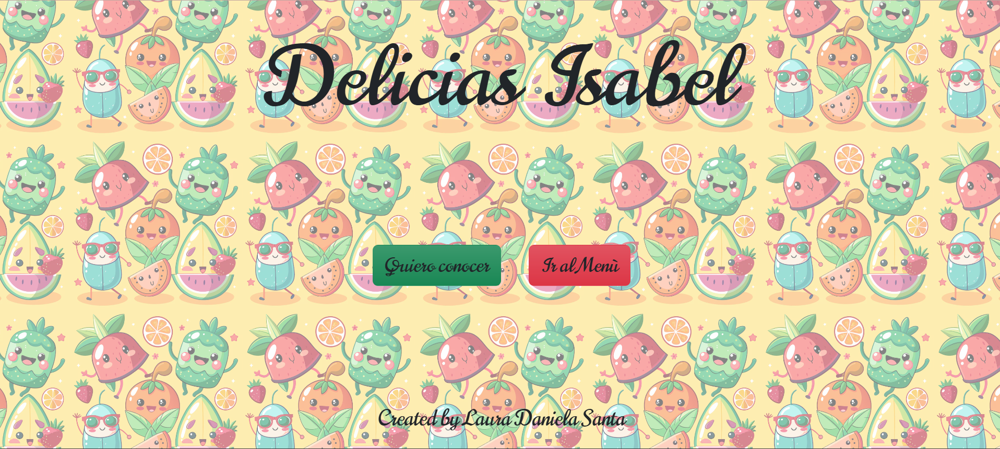

# 🍰 Isabel's Restaurant — Proyecto Front-End 🌸

¡Bienvenida/o a mi primer proyecto práctico de desarrollo web!  
Este proyecto es una página web inspirada en un menú digital de un restaurante, creada con mucho cariño mientras aprendo HTML, CSS y JavaScript.  
Mi objetivo es construir mi portafolio profesional como Front-End, QA Manual y Automation Tester. 💖

---

## 🎀 Tecnologías utilizadas

- **HTML5** → estructura del sitio  
- **CSS3** → estilos y colores pastel ✨  
- **JavaScript** → botones interactivos como aumentar/restar cantidades
- **Bootstrap**
- **Git & GitHub** → control de versiones y despliegue del proyecto

---

## 🍧 Funcionalidades principales

- Página organizada en varias secciones  
- Tabla interactiva de productos  
- Botones que aumentan y disminuyen cantidades con JavaScript  
- Imágenes, efectos hover, estilos suaves y diseño pensado para aprender buenas prácticas

---

## 🎨 Vista previa del proyecto

  

> ✨ *Proyecto realizado con tonos pastel para transmitir suavidad, calma y estética agradable.*

---

## 🌼 Cómo ejecutar el proyecto

1. Descarga el repositorio  
2. Abre el archivo **index.html** en tu navegador  
3. ¡Listo! Puedes navegar y ver la página

---

## 💗 Acerca de mí

Soy Laura Daniela Santa Correa, estudiante de Front-End, QA y Automation.  
Tengo experiencia en el sector bancario
Este proyecto es parte de mi proceso para construir mi portafolio profesional en GitHub.  
Estoy practicando HTML, CSS, JavaScript y Git por primera vez. 🌸

---

## 📌 Estado del proyecto

✔ Finalizado  
✔ Subido correctamente a GitHub  
✨ En constante aprendizaje y mejora.

---

## 🙌 Gracias por visitar mi proyecto

Si llegaste hasta aquí, ¡muchas gracias!  
Cada paso que doy es un logro en mi camino profesional, y este repositorio representa mi comienzo.

